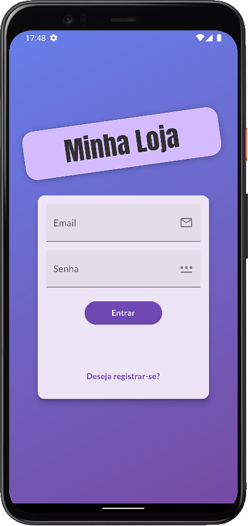
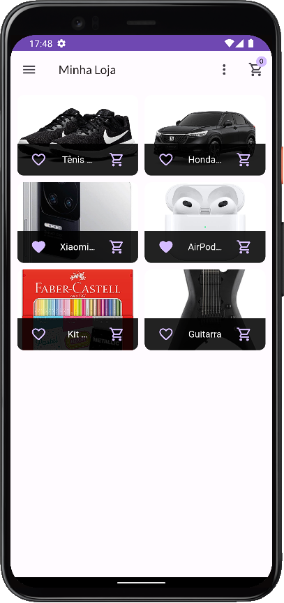
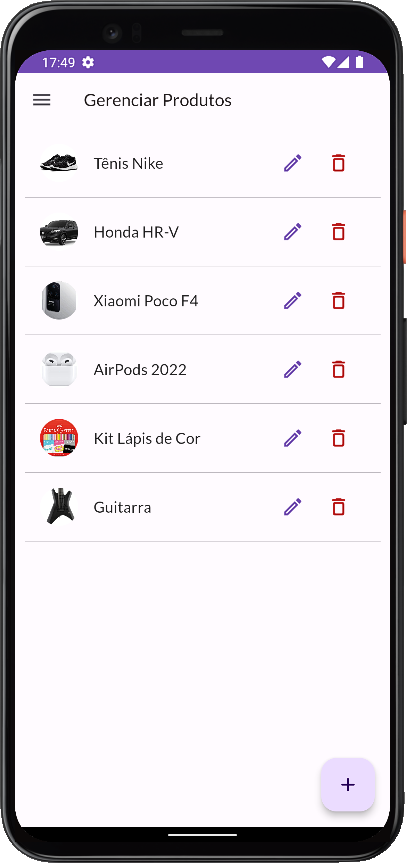
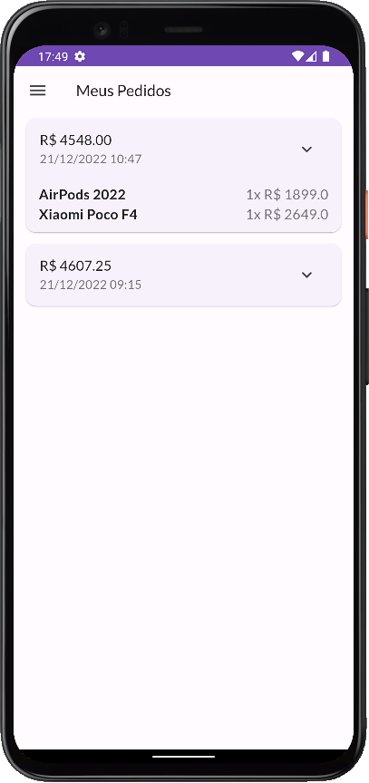

# shop-app

<p align="left">
   
   <!--  -->
   
</p>

App de loja com autenticação para exibição e cadastro de produtos desenvolvido com a linguagem Dart e framework Flutter.

## :hammer: Funcionalidades do projeto
* `Detalhes:` ao clicar em um produto da loja é aberto a tela de detalhes do produto.
* `Favoritos:` opção para favoritar um produto e filtrar para exibir somente os produtos favoritados.
* `Carrinho:` opção colocar os produtos no carrinho, ver a quantidade e o preço de cada produto no carrinho e o valor total dos produtos no carrinho.
* `Pedidos:` ao clicar em comprar na tela do carrinho é feito um pedido que será exibido na tela de pedidos, com valor total, items e data e hora do pedido.
* `Gerenciamento de produtos:` formulário para cadastrar um novo produto ou editar um já existente e opção para excluir um produto da loja.
* `Autenticação:` tela de login, cadastro de usuários e informações salvas por usuário.

<br>
<div display: inline_block align="center">
   
   
   
   
</div>

## :file_folder: Acesso ao projeto
Você pode [acessar o código-fonte do projeto](https://github.com/GabrielSchiavo/shop-app) ou [baixá-lo](https://github.com/GabrielSchiavo/shop-app/archive/refs/heads/main.zip).

## :hammer_and_wrench: Abrir e rodar o projeto
Após baixar o projeto, você pode abrir com o Visual Studio Code. Para o projeto funcionar você deve ter configurado em seu PC:

* Flutter - Versão >=2.18.2 <3.0.0

Abra um terminal na pasta raiz do projeto e execute estes comandos:
```bash
dart pub get
```
```bash
flutter pub get
```

* `Configurando os SDKs do Firebase:`
Acesse a documentação oficial do Firebase em https://firebase.google.com/docs/android/setup. Nos arquivos do projeto encontre todas as ocorrências de "com.exemple.app" e substitua por um ID de pacote único de sua escolha.

<!-- * `Console do Firebase:` 
No Console do Firebase configure o serviço de "Authentication" para o método de login com "E-mail/senha" e configure o "Realtime Database" e altere suas regras para:
```bash
{
  "rules": {
    "orders": {
      "$uid": {
        ".write": "$uid === auth.uid",
        ".read": "$uid === auth.uid", 
      },
    },
    "userFavorites": {
      "$uid": {
        ".write": "$uid === auth.uid",
        ".read": "$uid === auth.uid", 
      },
    },
    "products": {
      ".write": "auth != null",
      ".read": "auth != null", 
    }
  }
}
```
Ainda no Console do Firebase copie sua "Chave de API da Web" e nos arquivos do projeto encontre todas as ocorrências de "[Your Web API Key]" e substitua pela sua Chave de API da Web. No Realtime Database copie sua "URL de referência" e nos arquivos do projeto encontre todas as ocorrências de "[Your Reference URL]" e substitua pela sua "URL de referência". -->

Agora ao abrir o projeto com o Visual Studio Code, abra o arquivo "main.dart" localizado na pasta "lib", agora pode executar ou depurar no seu smartphone, em um emulador Android ou iOS, no Windows ou no navegador.

## :white_check_mark: Tecnologias utilizadas
* `Dart - 2.18.2`
* `Flutter - 3.3.6`
* `Firebase - Realtime Database`
* `flutter launcher icons - 0.10.0`
* `flutter native splash - 2.2.14`
* `provider - 6.0.4`
* `intl - 0.17.0`
* `http - 0.13.5`
* `shared_preferences - 2.0.15`
* `Material Design 3`
